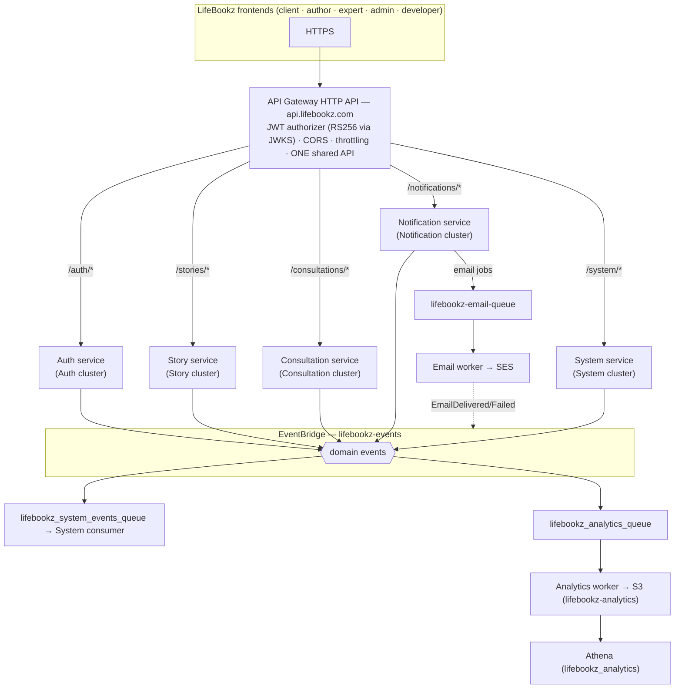

# LifeBookz — AWS Serverless Microservice Architecture

A production-oriented re-architecture of the LifeBookz monolithic backend
(`../backend`, which remains the source of truth for existing functionality and
is **not modified**) into five independently deployable business services, two
queue workers and a shared library layer, on AWS serverless infrastructure.

> **Rule of the repo:** the monolith defines *what the product does*; this
> document and the code define *how it runs*. No functionality was invented;
> nothing existing was dropped. See `ARCHITECTURE-MAPPING.md` for the
> route-by-route, model-by-model provenance of every piece of code here.

## Directory structure

```text
backend-microservice-architecture/
├── services/
│   ├── auth/           Identity, RS256 JWT issuance, OTP reset, JWKS, profiles handoff
│   ├── story/          Lifebooks, chapters, story entries, engagement, following, search, testimonials
│   ├── consultation/   Expert profiles, matching, bookings
│   ├── notification/   In-app inbox + email job production (never sends email itself)
│   └── system/         Admin/developer portals + the platform's shared infrastructure stack
├── workers/
│   ├── email/          SQS → SES. No HTTP API.
│   └── analytics/      SQS → S3 (Athena queries it). No HTTP API, no MongoDB.
├── shared/             auth / events / aws / errors / logger / validation
├── scripts/            Verification guards (imports, env contract, packaging)
├── package.json        npm workspaces + deploy scripts
└── ARCHITECTURE-MAPPING.md
```

## 1. Architecture



Every business service owns exactly one MongoDB Atlas cluster. Queues have
DLQs with `maxReceiveCount: 5`. Media lives in Cloudflare R2; analytics in S3.

## 2. Service responsibilities

| Service | Owns | Key routes |
| --- | --- | --- |
| **auth** | Account identity (single `Account` collection for reader/author/expert), registration, login, RS256 token issuance + refresh/revocation (`tokenVersion`), OTP password reset, JWKS/openid endpoints, reader profile media | `POST /api/v1/auth/register|login|refresh`, `POST /api/v1/auth/forgot-password|verify-reset-otp|reset-password`, `GET /.well-known/jwks.json`, `GET|PATCH|DELETE /api/v1/users/me` |
| **story** | Author professional profiles (`AuthorProfile`), lifebooks → chapters → story entries (visibility per entry), likes/comments/replies, following, search, testimonials, author media | `/api/v1/stories/*`, `/api/v1/authors/*`, `/api/v1/following/*`, `/api/v1/search`, `/api/v1/testimonials/*` |
| **consultation** | Expert professional profiles (`ExpertProfile`), category matching, bookings + status transitions | `/api/v1/consult/*`, `/api/v1/experts/*` |
| **notification** | In-app notifications (polymorphic recipient), unread/read state, recipient read model, **email job production** to SQS | `/api/v1/notifications/*` |
| **system** | Admin review queues, verification *coordination* (Auth executes), audit trail; owns the shared API Gateway/bus/queues stack | `/api/v1/system/*`, `/api/v1/developer/*` |

**Profile/account split (deliberate):** Auth keeps one `Account` per person —
identity only (email, username, password, avatar, status, verification). The
onboarding-heavy professional data lives where it is *used*:

- `AuthorProfile` → **Story** cluster (profession, bio, dob, gender, address,
  social links, covers, `isProfileCompleted` → unlocks publishing).
- `ExpertProfile` → **Consultation** cluster (phone, expertise, qualification,
  categories, languages, experience, price, rating/sessions).

`_id` is the account id; identity changes propagate via `AccountProfileUpdated`
events; `PATCH /authors/me` and `PATCH /experts/me` also accept identity fields
so the existing portals' save-in-one-request flow keeps working (one writer per
field: Auth).

## 3. Database ownership

| Cluster | Collections | Owner |
| --- | --- | --- |
| Auth | `accounts`, `refreshtokens` | auth |
| Story | `authorprofiles`, `lifebooks`, `engagements` (likes/comments/follows), `testimonials`, `processedevents` | story |
| Consultation | `expertprofiles`, `bookings`, `processedevents` | consultation |
| Notification | `notifications`, `accountprojections`, `processedevents` | notification |
| System | `reviewqueues`, `auditlogs`, `processedevents` | system |

Cross-service data access is forbidden (enforced by
`npm run check:imports`). The only duplication allowed is an **event-fed read
model projection** (e.g. Story's copy of the author display name).

## 4. API Gateway design

One HTTP API for everything (spec §7), created by the `system` stack:

- `provider.httpApi` with `authorizers.lifebookzJwt` and CORS pinned to the
  five real frontend origins.
- Other stacks attach via `httpApi.id: !ImportValue lifebookz-<stage>-http-api-id`
  — independent deploys, one API.
- Exports: `http-api-id`, `http-api-endpoint`, `jwt-authorizer-id`, bus and
  queue ARNs/URLs.
- No Lambda function URLs anywhere.

## 5. Authentication

RS256 only. Auth mints access tokens (15 min) with a private key from Secrets
Manager; API Gateway's JWT authorizer validates signature/issuer/audience from
Auth's JWKS (`/.well-known/jwks.json`) **before** any business Lambda runs.
Business services read verified claims from
`event.requestContext.authorizer.jwt.claims` (`shared/auth.readClaims`) and
never verify tokens themselves.

- `kid`: `lifebookz-auth-2026-09`; rotation = generate new keypair, publish
  both keys in JWKS (previous as `JWT_PREVIOUS_*`), flip `JWT_KID`, retire old.
- Refresh tokens: opaque random strings hashed in the Auth cluster (30 days,
  rotating); revocation via `credentials.tokenVersion` bump.
- Payload carries `sub` (accountId), `role`, `tokenVersion` — enough for the
  coarse checks; never the profile.

## 6. Authorization

API Gateway answers *who*; services answer *may they*. Every route declares an
`access` rule (public / authenticated / role list) enforced by the shared
router as defense-in-depth; resource-level checks (the booking's client, the
story's author, the recipient of a notification) stay in the owning service.

## 7. EventBridge

Bus `lifebookz-events`. Every event type is declared in
`shared/events/src/registry.js` with owner + version; publishing an undeclared
type throws. Envelope: `eventId`, `eventType`, `eventVersion`, `occurredAt`,
`source`, `actor`, `correlationId`, `data` (minimal payload, no documents).
Events flagged `analytics: true` are routed to the analytics queue by a
rule with an explicit detail-type allow-list — PII-bearing types
(`OtpRequested`, `AccountProfileUpdated`, `RequestFailed`) are excluded.

## 8. SQS & 9. DLQs

Per-service inbound queues (EventBridge → SQS → Lambda consumer) plus the two
worker queues. All standard queues, redrive `maxReceiveCount: 5` — enough to
ride out transient dependency errors (Atlas leader election, SES throttling)
without pinning poison messages for hours; DLQ retention 14 days. Consumers
return `batchItemFailures` so only genuinely failed messages retry.

## 10. Email flow

```
auth/consultation/admin decisions → domain events → Notification
    → deterministic jobId (sha256 of template+recipient+sourceEvent)
    → lifebookz-email-queue → email worker
    → DynamoDB idempotency claim → SES send
    → EmailDelivered / EmailFailed events
```

Six templates, exactly the monolith's sends: welcome, password-reset-otp,
booking-requested, booking-status, application-approved, application-rejected.
The API never waits on SES (`sendSafely` semantics throughout).

## 11. Analytics flow

Business services → EventBridge (allow-list rule) → analytics queue →
analytics worker → `s3://lifebookz-analytics/events/year=YYYY/month=MM/day=DD/*.jsonl`
→ Athena. Asynchronous; no API request waits on it; no Kinesis/Glue/Redshift.

## 12. S3 / Athena

`lifebookz-analytics` bucket: Block Public Access, bucket-owner-enforced,
AES256, `DenyInsecureTransport` policy. Worker IAM is `s3:PutObject` on
`events/*` only and **no Athena permissions** (spec §20). Athena database
`lifebookz_analytics`, results in `lifebookz-athena-results/query-results/`;
the table DDL is in `workers/analytics/README.md`. Query-time dedup on
`eventId` handles at-least-once redelivery.

## 13. R2

All application media (avatars, covers, story media) stays in Cloudflare R2
with presigned PUTs — the client uploads directly, Lambda never proxies bytes.
The R2 client disables flexible checksums (the SDK's CRC32 default breaks R2 —
a real monolith bug encoded into `shared/aws`). S3 is analytics only; the two
never mix.

## 14. IAM

Per-function least privilege; no `AdministratorAccess`, no `*` actions.
Highlights: story/consultation/notification can `events:PutEvents` + their own
secrets + their queue receive; email worker has exactly the SQS receive trio +
`ses:SendEmail`/`SendRawEmail` + its idempotency table; analytics worker has
the SQS trio + `s3:PutObject`. AWS keys never appear in Lambda env vars —
execution roles only.

## 15. Environment variables

Root `.env.example` documents the global contract; each unit's
`.env.example` lists exactly what it consumes (verified by
`npm run check:env`). Only secret *ids* live in env vars; values come from
Secrets Manager. Local development uses direct values (`MONGODB_*_URI`) with
Secrets Manager ids preferred in AWS. `RAZORPAY_API_KEY` is documented but
unused — the monolith has zero Razorpay references (verified).

## 16. Local development

```bash
npm install            # workspaces: services/*, workers/*, shared/*
npm test               # all unit tests (node:test) — no AWS required
npm run check          # import guard + env contract + tests
npm run package:all    # serverless package for every unit (CloudFormation check)
```

Services are plain Node ESM with dependency injection, so tests run with
fakes (in-memory repositories, fake SES/S3/EventBridge clients). For live
local runs, fill the root `.env` (real Atlas URIs, R2 keys) and per-unit
`.env` files; handlers resolve Mongo via env value **or** Secrets Manager id.

## 17. Deployment

```bash
npm run deploy:system        # FIRST — creates API, authorizer, bus, queues, bucket
npm run deploy:auth          # then the business services (any order)
npm run deploy:story
npm run deploy:consultation
npm run deploy:notification
npm run deploy:email-worker
npm run deploy:analytics-worker
```

No manual Lambda/API creation. Each unit is independently deployable; only
`system` must exist before the rest (they import its outputs).

## 18. Custom API domain

`api.lifebookz.com`. The `system` stack ships the domain wiring hooks
(`provider.httpApi.domain` commented with the ACM certificate variable), plus
`API_DOMAIN_NAME`/`API_CERTIFICATE_ARN` in the root env. DNS: CNAME/alias the
domain to the API Gateway endpoint (Cloudflare DNS-only mode for the API
subdomain; proxying is a dashboard concern, not code). Auth's issuer
(`https://api.lifebookz.com`) and JWKS URLs are already domain-based, so the
authorizer works unchanged once the domain is attached.

## 19. Testing

Per unit: `npm test` (node:test). Business services test flows with fakes:
auth (registration → token → refresh → rotate/reset, OTP rate limits, service
token decision endpoint), story (lifebook domain, visibility, engagement,
routes), consultation (matching, booking lifecycle, profile completeness),
notification (event → notification, dedupe keys, email job determinism,
fan-out cap), system (review queue, admin decision coordination, audit trail).
Workers test batch processing, idempotency, permanent-vs-transient failures,
DLQ routing, PII scrubbing, partition keys.

## 20. Migration considerations

- **Dual-run safe:** the new stack is fully parallel; the monolith keeps
  serving until cutover. The frontends only change their base URL.
- **Auth cut-over is the hard part:** the monolith's HS256 tokens are
  incompatible by design. Plan a maintenance window for password-based
  re-login (refresh tokens don't migrate); OTP reset is the natural fallback.
- **Data migration:** one-time copy per cluster (User→Account, Author→
  Account+AuthorProfile, Story→Story, Booking→Consultation, notifications→
  Notification). The mapping document lists source collections.
- **Event replay:** consumers are idempotent (unique `eventId` + TTL), so
  replaying the bridge into new consumers is safe.
- **Fan-out cap:** `StoryPublished` fan-out is capped (default 500 followers
  per event) because the follower list rides in the event; the long-term fix
  is a dedicated fan-out worker reading Story's follow graph in pages.
- **Razorpay:** not present in the monolith; when payments arrive they should
  be a sixth service, not a bolt-on here.
